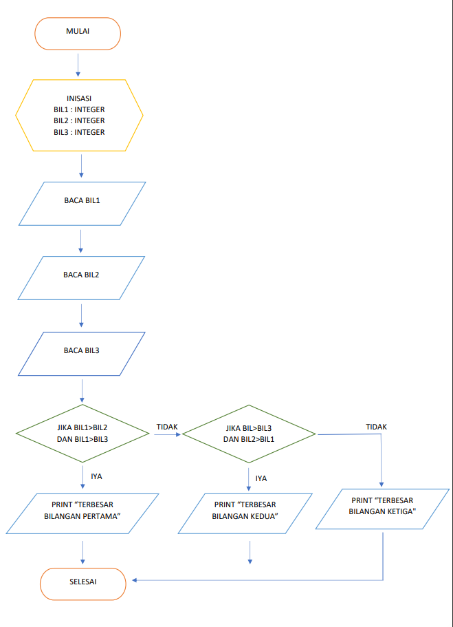

# pertemuan7

# LATIHAN 1 
## MEMBUAT PROGRAM DENGAN MENGINPUT 2 BUAH BILANGAN UNTUK MENENTUKAN BILANGAN TERBESAR MENGGUNAKAN STATEMENT IF

## Source Code & Output (Hasil Running Program)
Berikut ini adalah Source Code Latihan 1 :
```
angka1 = input("Masukkan Bilangan 1 = ")
angka2 = input("Masukkan Bilangan 2 = ")
if (angka1>angka2) :
    hasil = "Besar"
else :
    hasil = "Kecil"
print()
print("bilangan", angka1, "lebih", hasil, "dari pada", "bilangan", angka2)
```


# LATIHAN 2
## MEMBUAT PROGRAM UNTUK MENGURUTKAN DATA SECARA BERURUTAN MULAI DARI DATA TERKECIL

## Source Code & Output (Hasil Running Program)
Berikut ini adalah Source Code Latihan 2 :
```
inisialisasi variabel luas dengan nilai berformat array
luas = [34,56,1,3,6,99,100]
urutkan data di dalam list dari yang terkecil ke yang terbesar
luas.sort()
tampilkan nilai dari variabel luas setelah pengurutan
print(luas)
[1, 3, 6, 34, 56, 99, 100]
```


# LATIHAN 3
## MEMBUAT PROGRAM DENGAN PERULANGAN BERTINGKAT 

## Source Code & Output (Hasil Running Program)
Berikut ini adalah Source Code Latihan 3 :
```
for i in range(0, 10):
for j in range(0,10):
product = i+j
print(f"{product:>3}", end='')
print()
```


# LATIHAN 4
## MEMBUAT PROGRAM BILANGAN ACAK YANG LEBIH KECIL DARI 0.5 MENGGUNAKAN KOMBINASI WHILE DAN FOR

## Source Code & Output (Hasil Running Program)
Berikut ini adalah Source Code LATIHAN 4 :
```
import random
n = int(input("Masukkan nilai N :"))
for i in range(n):
a = random.uniform(0.0, 0.5)
print("Data ke :", i+1, "=> ", a)
print('Selesai Rani')
```


# TUGAS PRAKTIKUM 2
## MEMBUAT PROGRAM DENGAN MENGINPUT 3 BUAH BILANGAN UNTUK MENENTUKAN BILANGAN TERBESAR MENGGUNAKAN STATEMENT IF

## Source Code & Output (Hasil Running Program)
Berikut ini adalah Source Code LATIHAN 5 (PRAKTIKUM2) :
```
print("Praktikum2")
A = int (input("Masukkan bilangan pertama:"))
B = int (input("Masukkan bilangan kedua: "))
C = int (input("Masukkan bilangan ketiga: "))
if A > B > C :
    print("\nBilangan pertama adalah bilangan terbesar = %s" % A)
elif B > C :
    print("\nBilangan kedua adalah bilangan terbesat = %s" % B)
else :
    print("\nBilangan ketiga adalah bilangan terbesar = %s" % C)
```


## FLOWCHART 
1. MULAI
2. INISIASI BIL1, BIL2, BIL3 SEBAGAI INTEGER.
3. BACA BIL1.
4. BACA BIL2.
5. BACA BILL3.
6. JIKA BIL1 > BIL2 DAN BIL1 > BIL3 MAKA KERJAKAN LANGKAH 8, SELAIN ITU
7. JIKA BIL2 > BIL1 DAN BIL2 > BIL3 MAKA KERJAKAN LANGKAH 9, SELAIN ITU KERJAKAN LANGKAH 10.
8. CETAK "BILANGAN TERBESAR BILANGAN PERTAMA".
9. CETAK "BILANGAN TERBESAR BILANGAN KEDUA".
10. CETAK "BILANGAN TERBESAR BILANGAN KETIGA".
11. SELESAI.



# TUGAS PRAKTIKUM 3
## LATIHAN 2 MEMBUAT PROGRAM MENAMPILKAN BILANGAN TERBESAR DARI N SEBUAH DATA YANG DIINPUTKAN DAN MASUKKAN ANGKA 0 UNTUK BERHENTI

## Source Code & Output (Hasil Running Program)
Berikut ini adalah Source Code LATIHAN 6 (PRAKTIKUM3) :
```
n=1
a=0
while n !=0:
if n > a:
a = n
n = int(input("Masukkan bilangan: "))
if n == 0:
break
print("Nilai terbesarnya adalah:", a)
```


# TUGAS PRAKTIKUM 3
## MEMBUAT PROGRAM SEDERHANA DENGAN PERULANGAN

## Source Code & Output (Hasil Running Program)
Berikut ini adalah Source Code PRAKTIKUM 3 :
```
n = 100000000
sum = 0
y = 0
laba = [int(0), int(0), int(n) * 0.01, int(n) * 0.01, int(n) * 0.05, int(n) * 0.05, int(n) * 0.02]
for i in laba:
sum = sum+i
y += 1
print('Laba bulan ke-', y, 'sebesar : ', i)
print('Total laba adalah : ', sum)
```
